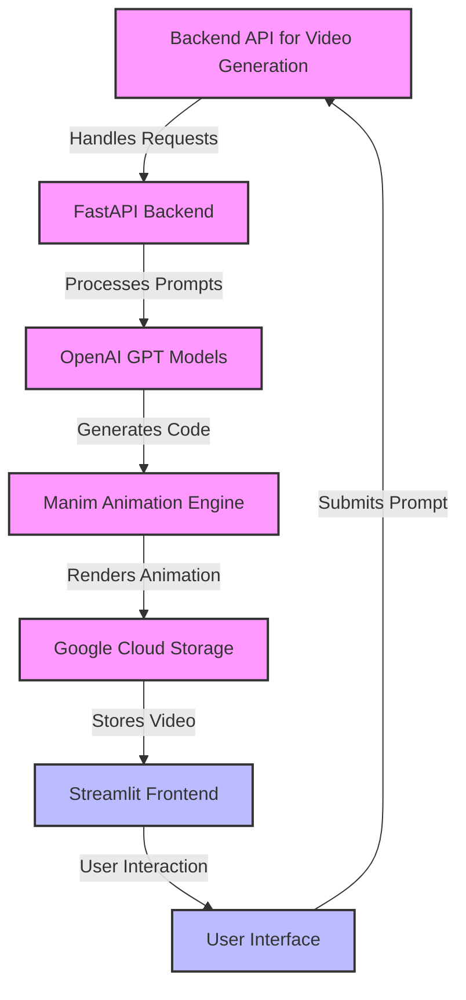

The Animated Video Generator is a powerful web application that combines natural language processing with animation technology to create custom animated videos. Here's an overview of its key components and functionality:

The backend API, implemented in FastAPI, handles the core functionality of video generation. It processes user prompts, interacts with OpenAI's GPT models to generate Manim code, and manages the rendering and storage of the resulting animations.

Key features:

*   OpenAI integration for code generation
*   Manim execution for animation rendering
*   Google Cloud Storage integration for video hosting

The frontend is built using Streamlit, providing an intuitive interface for users to input prompts and interact with the generated videos. It communicates with the backend API to process requests and display results.

Notable features:

*   Sample prompt suggestions
*   Video history tracking
*   Download functionality for generated videos

The application uses Google Cloud Storage for efficient management and distribution of generated video files. This component handles file uploads, generates public URLs, and manages signed URLs for secure access.

Key functionalities:

*   File upload to Google Cloud Storage
*   Generation of public and signed URLs
*   File download from Google Cloud Storage

1.  User inputs a natural language prompt
2.  Backend processes the prompt using OpenAI's GPT model to generate Manim code
3.  Manim renders the animation based on the generated code
4.  The resulting video is uploaded to Google Cloud Storage
5.  A public URL is generated and returned to the user

The application is designed for easy deployment on platforms like Render.com. It uses environment variables for configuration, allowing for flexible setup in different environments.

This project showcases an innovative approach to creating animated content, leveraging advanced AI and animation technologies to transform text prompts into visual representations.

